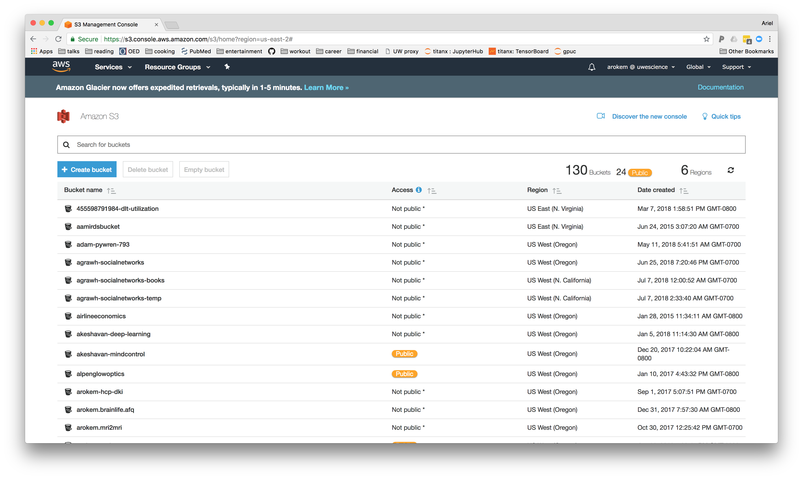
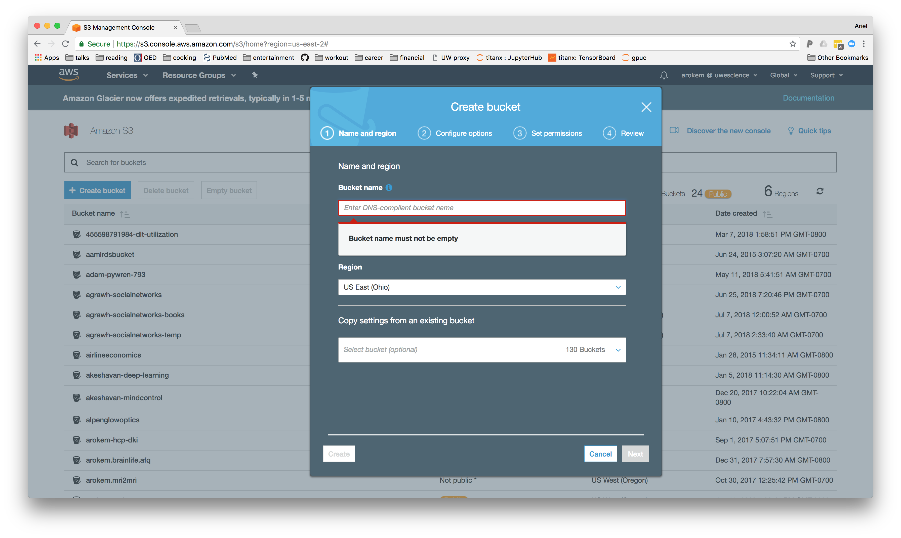
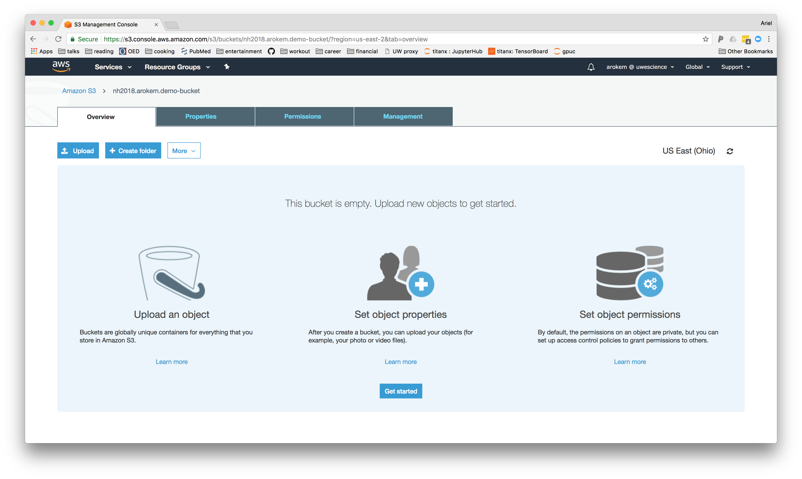

### Storage on the cloud: S3

In S3, we can create "buckets" with data. These are like folders on a
computer, except they're not really on any computer that we can access,
so we'll have to download them onto some other computers to do any
computations with the data.

One of the main things to remember about S3 is that storing data on S3 is
not very expensive ($0.024/GB/month) but you can end up paying quite a
bit if you move the data out of the AWS data-center in which your data is
stored. One way to avoid that is to do all your compute in that
data-center. That is, bring your compute to where the data is.

That means that you will want to keep an eye on the "region" in which the
data is stored (in our case Ohio) and only download the data to machines
that are in that region.

## Creating an object storage bucket

Creating a bucket for our data is done by clicking on the big blue button:

We'll choose a name, and make sure again that the region is Ohio

The next few dialogues allow us to configure settings of the bucket (such
as whether to log access to the bucket, whether to allow publich access
to the bucket, and so on).

Once we have created the bucket, we can find the bucket in our list. When we go into the bucket, we see that there's nothing there.

We can put some data in it. For example, by dragging and dropping.

## Creating a User

## Creating a Policy

## Creating a Role

## Using a Service
